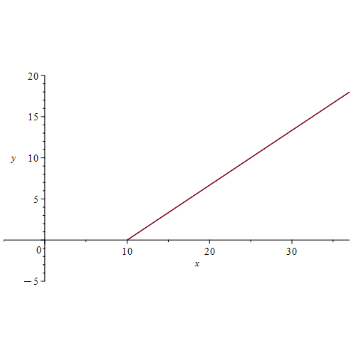
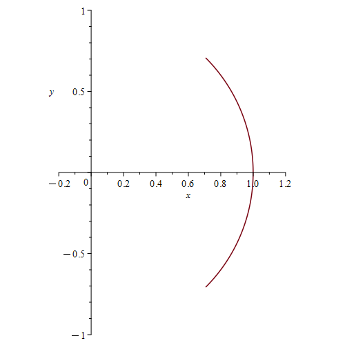
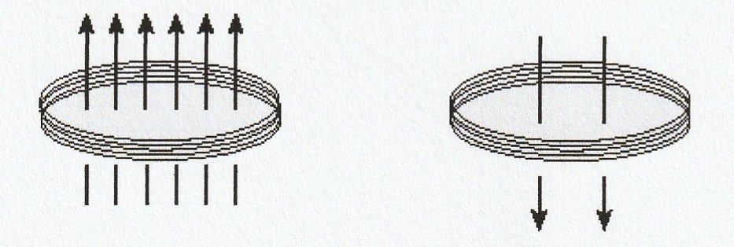
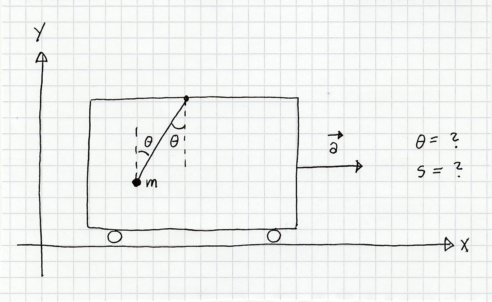
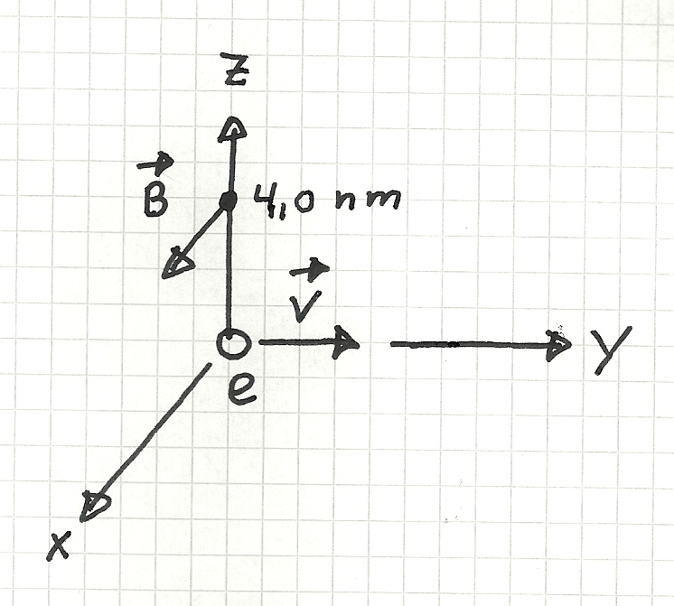
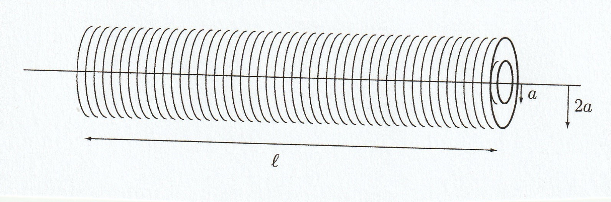

::: {#phys-constants .math-exercise-context}

Denne siden samler fysikkprøvene fra 2024–2026. Hver prøve ligger i en egen
nøstet fane. Regn først på papir og skriv deretter svarene i feltene. Bruk
`pi`, `sqrt(...)` og eksakt brøk når oppgaven ber om et uttrykk. For numeriske
svar er enheten skrevet ved feltet; ikke skriv enheten i selve feltet.

Når ikke annet er oppgitt, brukes
$g=9.81\,\mathrm{m/s^2}$, $\varepsilon_0=8.854\cdot10^{-12}\,\mathrm{F/m}$,
$\mu_0=4\pi\cdot10^{-7}\,\mathrm{H/m}$,
$k_e=8.99\cdot10^9\,\mathrm{Nm^2/C^2}$,
$e=1.60\cdot10^{-19}\,\mathrm C$,
$m_e=9.11\cdot10^{-31}\,\mathrm{kg}$ og
$m_p=1.67\cdot10^{-27}\,\mathrm{kg}$. Fet skrift og hake betyr vektorer.

:::

::: {.panel-tabset}

## 2024

::: {.panel-tabset}

### Prøve 1

**Oppgave 1 — bevegelse i planet**

::: {#phys-2024-1-1 .math-exercise-context}

En partikkel beveger seg i $xy$-planet med konstant akselerasjon
$\mathbf a=6\hat{\mathbf x}+4\hat{\mathbf y}$. Ved $t=0$ er
$\mathbf v(0)=\mathbf0$ og $\mathbf r(0)=10\hat{\mathbf x}$.
Bestem $\mathbf v(t)$, $\mathbf r(t)$ og ligningen $y=y(x)$ for banen, og
skisser banen.

:::

{fig-alt="Den rette partikkelbanen starter i punktet (10,0)." width="42%"}

```{math-exercise}
#| label: phys-2024-1-1
#| caption: Bevegelse med konstant akselerasjon
#| vars: t, x
#| mode: equivalent
#| partial-credit: true
#| context: phys-constants, phys-2024-1-1

$\mathbf v(t)=$ vec[6*t,4*t] m/s

$\mathbf r(t)=$ vec[10+3*t^2,2*t^2] m

$y(x)=$ __[2*(x-10)/3] m
```

**Oppgave 2 — kranlast**

::: {#phys-2024-1-2 .math-exercise-context}

En last på $2.00$ tonn løftes av en kran. Finn snordraget når akselerasjonen
er henholdsvis $1.20\,\mathrm{m/s^2}$ oppover, null og
$1.20\,\mathrm{m/s^2}$ nedover.

:::

```{math-exercise}
#| label: phys-2024-1-2
#| caption: Snordrag i tre faser
#| mode: numeric
#| tolerance: 1%
#| partial-credit: true
#| field-labels: oppover, konstant fart, nedover
#| context: phys-constants, phys-2024-1-2

$S_\uparrow=$ __[22.02] kN

$S_0=$ __[19.62] kN

$S_\downarrow=$ __[17.22] kN
```

**Oppgave 3 — konservativ kraft**

::: {#phys-2024-1-3 .math-exercise-context}

En partikkel påvirkes av
$\mathbf F(x,y)=y^3\hat{\mathbf x}+3xy^2\hat{\mathbf y}$. Bestem en
potensiell energi $E_p(x,y)$ med null additiv konstant. Partikkelen går mot
klokken langs enhetssirkelen fra
$\mathbf r_1=(\hat{\mathbf x}-\hat{\mathbf y})/\sqrt2$ til
$\mathbf r_2=(\hat{\mathbf x}+\hat{\mathbf y})/\sqrt2$. Finn arbeidet utført
av $\mathbf F$, og tegn den orienterte partikkelbanen.

:::

{fig-alt="Høyre bue av enhetssirkelen fra vinkel minus pi over fire til pi over fire." width="34%"}

```{math-exercise}
#| label: phys-2024-1-3
#| caption: Potensiell energi og arbeid
#| vars: x, y
#| mode: equivalent
#| partial-credit: true
#| field-labels: E_p, W
#| context: phys-constants, phys-2024-1-3

$E_p(x,y)=$ __[-x*y^3] J

$W_{1\to2}=$ __[1/2] J
```

**Oppgave 4 — harmonisk svingning**

::: {#phys-2024-1-4 .math-exercise-context}

En kloss med $m=1.0\,\mathrm{kg}$ og fjærstivhet
$k=36\,\mathrm{N/m}$ oppfyller $m\ddot x=-kx$. Bestem $x(t)$ når
$x(0)=0$ og $\dot x(0)=0.50\,\mathrm{m/s}$.

:::

```{math-exercise}
#| label: phys-2024-1-4
#| caption: Fjærbevegelsen
#| vars: t
#| mode: equivalent
#| context: phys-constants, phys-2024-1-4

$x(t)=$ __[sin(6*t)/12] m
```

**Oppgave 5 — bølge på streng**

::: {#phys-2024-1-5 .math-exercise-context}

La
$y(x,t)=(1.0\,\mathrm{cm})\sin((2.5\,\mathrm{rad/m})x+\omega t+\phi_0)$
ha fasefart $6.0\,\mathrm{m/s}$. Bestem perioden og fasekonstanten når
$y(0,0)=0.5\,\mathrm{cm}$ og $y_t(0,0)<0$. Oppgi
$0\le\phi_0<2\pi$.

:::

```{math-exercise}
#| label: phys-2024-1-5
#| caption: Periode og fase
#| mode: equivalent
#| partial-credit: true
#| context: phys-constants, phys-2024-1-5

$T=$ __[2*pi/15] s

$\phi_0=$ __[5*pi/6] rad
```

### Prøve 2

**Oppgave 1 — parallellplatekondensator**

::: {#phys-2024-2-1 .math-exercise-context}

En parallellplatekondensator har $d=0.10\,\mathrm{mm}$,
$A=4.0\cdot10^{-4}\,\mathrm{m^2}$ og dielektrisitetskonstant $\kappa=2.0$.
Den lagrede energien er $U_E=1.0\,\mu\mathrm J$. Bestem ladningen og
feltstyrken mellom platene.

:::

```{math-exercise}
#| label: phys-2024-2-1
#| caption: Kondensator
#| mode: numeric
#| tolerance: 3%
#| partial-credit: true
#| context: phys-constants, phys-2024-2-1

$Q=$ __[12] nC

$|\mathbf E|=$ __[1.7] MV/m
```

**Oppgave 2 — tre punktladninger**

::: {#phys-2024-2-2 .math-exercise-context}

Tre positive punktladninger ligger på $x$-aksen:
$q_1=25\,\mu\mathrm C$ ved $x=0$, $q_2=10\,\mu\mathrm C$ ved $x=2\,\mathrm m$
og $q_3=20\,\mu\mathrm C$ ved $x=3\,\mathrm m$. Bestem kraften på $q_3$,
feltet ved $x=4\,\mathrm m$, og fluksen ut av en kule med sentrum ved
$x=5\,\mathrm m$ og radius $4\,\mathrm m$. Positive fortegn betyr
$+\hat{\mathbf x}$ eller utadrettet fluks.

:::

```{math-exercise}
#| label: phys-2024-2-2
#| caption: Coulombs lov og Gauss' lov
#| mode: numeric
#| tolerance: 3%
#| partial-credit: true
#| context: phys-constants, phys-2024-2-2

$F_{3x}=$ __[2.3] N

$E_x(4\,\mathrm m)=$ __[0.22] MV/m

$\displaystyle\oint_S\mathbf E\cdot\mathbf n\,dA=$ __[3.4] MV m
```

**Oppgave 3 — uniformt ladet kule**

::: {#phys-2024-2-3 .math-exercise-context}

En ikke-ledende kule med radius $R=0.10\,\mathrm m$ har total ladning
$Q=20\,\mathrm{mC}$, symmetrisk fordelt i volumet. Bestem feltstyrken i
$\mathbf r_1=(2,2,2)\,\mathrm m$. En partikkel med
$m=6.0\cdot10^{-6}\,\mathrm{kg}$ og $q=2.0\,\mu\mathrm C$ slippes fra ro ved
$0.30\hat{\mathbf x}\,\mathrm m$; bestem hastighetsvektoren langt borte.
Bevegelsen går i $+\hat{\mathbf x}$-retning. Inne i kula er
$\mathbf E=b\mathbf r$; finn $b$ og ladningstettheten $\rho$. Skisser også
de radielle, utadrettede feltlinjene utenfor kula.

:::

```{math-exercise}
#| label: phys-2024-2-3
#| caption: Felt, energi og ladningstetthet
#| mode: numeric
#| tolerance: 4%
#| partial-credit: true
#| context: phys-constants, phys-2024-2-3

$|\mathbf E(2,2,2)|=$ __[15] MV/m

$v_\infty=$ __[20] km/s

$b=$ __[1.8e11] V/m²

$\rho=$ __[4.8] C/m³
```

### Prøve 3

**Oppgave 1 — felt fra rett leder**

::: {#phys-2024-3-1 .math-exercise-context}

En lang rett leder ligger langs $z$-aksen med strøm $I=+22\,\mathrm A$.
Tegn feltlinjene i $xy$-planet og bestem retningen med høyrehåndsregelen.
En partikkel med
$q=2.0\,\mu\mathrm C$ er ved $\mathbf r=4.0\hat{\mathbf y}\,\mathrm m$ og har
$\mathbf v=(0,2.0,3.0)\,\mathrm{km/s}$. Bestem kraften i nN.

:::

```{math-exercise}
#| label: phys-2024-3-1
#| caption: Magnetisk kraft
#| mode: equivalent
#| context: phys-constants, phys-2024-3-1

$\mathbf F=$ vec[0,-6.6,4.4] nN
```

**Oppgave 2 — ladde partikler i magnetfelt**

::: {#phys-2024-3-2 .math-exercise-context}

(a) Et proton går i en sirkel med radius $0.80\,\mathrm m$ vinkelrett på
$\mathbf B=0.50\hat{\mathbf z}\,\mathrm T$. Finn periode, fart og
sentripetalakselerasjon. Tegn banen, angi om bevegelsen går med eller mot
klokken sett ovenfra, og begrunn retningen. (b) Et elektron med fart
$4.00\cdot10^3\,\mathrm{m/s}$ i et felt på $1.25\,\mathrm T$ påvirkes av
$1.40\cdot10^{-16}\,\mathrm N$; finn begge vinklene mellom $\mathbf v$ og
$\mathbf B$. (c) En ladning $q=-1.0\,\mathrm{nC}$ i origo beveger seg med
$10^5\hat{\mathbf x}\,\mathrm{m/s}$. Finn feltet i
$(0,-0.60,0.80)\,\mathrm{mm}$ i µT.

:::

```{math-exercise}
#| label: phys-2024-3-2a
#| caption: Protonets sirkelbevegelse
#| mode: numeric
#| tolerance: 4%
#| partial-credit: true
#| context: phys-constants, phys-2024-3-2

$T=$ __[0.13] µs

$v=$ __[38] Mm/s

$a=$ __[1.8e15] m/s²

Bruk fortegnskonvensjonen $s=+1$ for mot klokken og $s=-1$ for med klokken:
$s=$ __[-1]
```

```{math-exercise}
#| label: phys-2024-3-2b
#| caption: To mulige vinkler
#| mode: numeric
#| tolerance: 2%
#| partial-credit: true
#| context: phys-constants, phys-2024-3-2

$\theta_1=$ __[asin(0.175)] rad

$\theta_2=$ __[pi-asin(0.175)] rad
```

```{math-exercise}
#| label: phys-2024-3-2c
#| caption: Felt fra den bevegelige ladningen
#| mode: equivalent
#| context: phys-constants, phys-2024-3-2

$\mathbf B_c=$ vec[0,8,6] µT
```

**Oppgave 3 — Ampères lov**

::: {#phys-2024-3-3 .math-exercise-context}

Tre lange ledere er parallelle med $z$-aksen. Kurven $\alpha$ går mot
klokken rundt leder 1 og 2, $\beta$ går mot klokken rundt leder 1 og 3, og
$\gamma$ går med klokken rundt leder 2 og 3. Integralene er
$\oint_\alpha\mathbf B\cdot d\mathbf r=4\pi\cdot10^{-6}\,\mathrm{Tm}$ og
$\oint_\beta\mathbf B\cdot d\mathbf r=
\oint_\gamma\mathbf B\cdot d\mathbf r=5.6\pi\cdot10^{-6}\,\mathrm{Tm}$.
Positiv strøm er $+\hat{\mathbf z}$. Finn strømmene.

:::

```{math-exercise}
#| label: phys-2024-3-3
#| caption: Tre ukjente strømmer
#| mode: equivalent
#| context: phys-constants, phys-2024-3-3

$(I_1,I_2,I_3)=$ vec[19,-9,-5] A
```

### Prøve 4

**Oppgave 1 — toroid**

::: {#phys-2024-4-1 .math-exercise-context}

En toroidespole har $\mu_r=2.0\cdot10^3$, $N=50$, høyde $h=1.0\,\mathrm{cm}$
og radier $R_1=1.0\,\mathrm{cm}$, $R_2=2.0\,\mathrm{cm}$. Finn
selvinduktansen. Når fluksen gjennom hver vikling er $1.0\,\mathrm{mWb}$,
finn strømmen og den lagrede magnetiske energien.

:::

```{math-exercise}
#| label: phys-2024-4-1
#| caption: Toroidespole
#| mode: numeric
#| tolerance: 3%
#| partial-credit: true
#| context: phys-constants, phys-2024-4-1

$L=$ __[6.9] mH

$I=$ __[7.2] A

$U_B=$ __[0.18] J
```

**Oppgave 2 — Ampère–Maxwells lov**

::: {#phys-2024-4-2 .math-exercise-context}

I et område er
$\mathbf E=(\beta/\varepsilon_0)t\hat{\mathbf x}+
(\alpha/\varepsilon_0)t\hat{\mathbf z}$ og
$\mathbf B=\beta\mu_0[-y\hat{\mathbf x}+(x-z)\hat{\mathbf y}+y\hat{\mathbf z}]$,
der $\alpha=43\,\mathrm{A/m^2}$ og $\beta=124\,\mathrm{A/m^2}$. Bestem
strømtettheten.

:::

```{math-exercise}
#| label: phys-2024-4-2
#| caption: Strømtetthet
#| mode: equivalent
#| context: phys-constants, phys-2024-4-2

$\mathbf j=$ vec[124,0,205] A/m²
```

**Oppgave 3 — endret magnetfelt**

::: {#phys-2024-4-3 .math-exercise-context}

En sirkulær spole har $N=500$ og areal $1.54\cdot10^{-2}\,\mathrm{m^2}$.
Feltet endres fra $0.060\hat{\mathbf z}\,\mathrm T$ til
$-0.020\hat{\mathbf z}\,\mathrm T$ på $0.12\,\mathrm s$. Positiv retning
er mot klokken sett fra $+z$. Finn gjennomsnittlig $z$-komponent av
$\nabla\times\mathbf E$ og gjennomsnittlig ems. Kontroller retningen med
Lenz' lov.

:::

{fig-alt="Spole med magnetfelt først i positiv og så i negativ retning." width="55%"}

```{math-exercise}
#| label: phys-2024-4-3
#| caption: Faradays lov
#| mode: numeric
#| tolerance: 3%
#| partial-credit: true
#| context: phys-constants, phys-2024-4-3

$\overline{(\nabla\times\mathbf E)_z}=$ __[0.6666667] V/m²

$\overline\varepsilon=$ __[5.1333] V
```

**Oppgave 4 — bevegelig kvadratisk sløyfe**

::: {#phys-2024-4-4 .math-exercise-context}

En kvadratisk sløyfe med side $s$ beveger seg mot høyre med fart $v$ gjennom
et område der $\mathbf B=-B\hat{\mathbf z}$ og feltet er null utenfor.
Positiv sløyferetning er mot klokken. Finn ems i tre situasjoner: (i) hele
sløyfen er i det uniforme feltet, (ii) sløyfen er på vei ut slik at venstre
side fortsatt ligger i feltet, og (iii) sløyfen krysser en horisontal
feltgrense mens den beveger seg parallelt med grensen.

:::

```{math-exercise}
#| label: phys-2024-4-4
#| caption: Bevegelsesinduksjon
#| vars: v, B, s
#| mode: equivalent
#| partial-credit: true
#| context: phys-constants, phys-2024-4-4

$(\varepsilon_i,\varepsilon_{ii},\varepsilon_{iii})=$ vec[0,-v*B*s,0] V
```

:::

## 2025

::: {.panel-tabset}

### Prøve 1

**Oppgave 1 — arbeid og avstand**

::: {#phys-2025-1-1 .math-exercise-context}

En partikkel med masse $m=4\,\mathrm{kg}$ har konstant akselerasjon
$\mathbf a=3\hat{\mathbf x}-2\hat{\mathbf y}$, med $\mathbf v(0)=\mathbf0$
og $\mathbf r(0)=-5\hat{\mathbf x}\,\mathrm m$. Finn arbeidet utført fra
$t=1$ til $t=4\,\mathrm s$ og avstanden fra origo ved $t=4\,\mathrm s$.

:::

```{math-exercise}
#| label: phys-2025-1-1
#| caption: Arbeid og posisjon
#| mode: numeric
#| tolerance: 1%
#| partial-credit: true
#| context: phys-constants, phys-2025-1-1

$W_{1\to4}=$ __[390] J

$|\mathbf r(4)|=$ __[sqrt(617)] m
```

**Oppgave 2 — pendel i akselererende bil**

::: {#phys-2025-1-2 .math-exercise-context}

En pendelkule med masse $0.30\,\mathrm{kg}$ henger i en bil som akselererer
med $4.0\hat{\mathbf x}\,\mathrm{m/s^2}$. Snordraget er
$\mathbf S=S\sin\theta\hat{\mathbf x}+S\cos\theta\hat{\mathbf y}$.
Tegn frilegemediagrammet, sett opp Newtons andre lov i begge retninger og
finn $S$ og vinkelen med vertikalen.

:::

{fig-alt="Pendel i en bil som akselererer mot høyre." width="65%"}

```{math-exercise}
#| label: phys-2025-1-2
#| caption: Snordrag og vinkel
#| mode: numeric
#| tolerance: 2%
#| partial-credit: true
#| context: phys-constants, phys-2025-1-2

$S=$ __[3.18] N

$\theta=$ __[atan(4/9.81)] rad
```

**Oppgave 3 — fjær**

::: {#phys-2025-1-3 .math-exercise-context}

En kloss med $m=1.0\,\mathrm{kg}$ og $k=81\,\mathrm{N/m}$ oppfyller
$m\ddot x=-kx$, med $x(0)=0$ og $\dot x(0)=0.54\,\mathrm{m/s}$. Bestem
$\ddot x(t)$ og endringen i potensiell energi fra $t=0$ til $t=\pi\,\mathrm s$.

:::

```{math-exercise}
#| label: phys-2025-1-3
#| caption: Akselerasjon og energiforskjell
#| vars: t
#| mode: equivalent
#| partial-credit: true
#| context: phys-constants, phys-2025-1-3

$\ddot x(t)=$ __[-4.86*sin(9*t)] m/s²

$\Delta E_p=$ __[0] J
```

**Oppgave 4 — bølgeparametre**

::: {#phys-2025-1-4 .math-exercise-context}

La $y=(1.2\,\mathrm{cm})\sin(kx+\omega t+\phi_0)$ ha fasefart
$6.0\,\mathrm{m/s}$ og frekvens $34\,\mathrm{Hz}$. Bestem $k$, $\omega$ og
$\phi_0$ når $y_t(0,0)=1.0\,\mathrm{m/s}$ og $y(0,0)<0$. Oppgi
$-\pi<\phi_0\le\pi$.

:::

```{math-exercise}
#| label: phys-2025-1-4
#| caption: Bølgetall, vinkelfrekvens og fase
#| mode: equivalent
#| partial-credit: true
#| context: phys-constants, phys-2025-1-4

$k=$ __[34*pi/3] rad/m

$\omega=$ __[68*pi] rad/s

$\phi_0=$ __[-acos(1/(0.816*pi))] rad
```

### Prøve 2

**Oppgave 1 — kondensator**

::: {#phys-2025-2-1 .math-exercise-context}

En parallellplatekondensator har $d=0.10\,\mathrm{mm}$,
$A=4.0\cdot10^{-4}\,\mathrm{m^2}$, $\varepsilon=2\varepsilon_0$ og
ladninger $\pm13\,\mathrm{nC}$. Finn lagret energi og potensialdifferansens
størrelse.

:::

```{math-exercise}
#| label: phys-2025-2-1
#| caption: Energi og spenning
#| mode: numeric
#| tolerance: 4%
#| partial-credit: true
#| context: phys-constants, phys-2025-2-1

$U_E=$ __[1.2] µJ

$|\Delta V|=$ __[0.18] kV
```

**Oppgave 2 — ladet metallkule**

::: {#phys-2025-2-2 .math-exercise-context}

En metallkule med radius $0.30\,\mathrm m$ og sentrum i origo har
$Q=2.0\,\mu\mathrm C$ på overflaten. La
$\mathbf r_1=0.80\hat{\mathbf x}\,\mathrm m$. Finn feltet i origo og ved
$\mathbf r_1$, potensialforskjellen $V(\mathbf0)-V(\mathbf r_1)$, total
feltenergi og fluksen ut av kuler med radius $0.80\,\mathrm m$ og
$0.20\,\mathrm m$.

:::

```{math-exercise}
#| label: phys-2025-2-2
#| caption: Ledende kule
#| mode: numeric
#| tolerance: 4%
#| partial-credit: true
#| context: phys-constants, phys-2025-2-2

$E_x(0)=$ __[0] kN/C

$E_x(0.80)=$ __[28.1] kN/C

$V(0)-V(0.80)=$ __[37.5] kV

$U_E=$ __[60] mJ

$\Phi_E(0.80)=$ __[0.226] MV m

$\Phi_E(0.20)=$ __[0] MV m
```

**Oppgave 3 — ladd partikkel mellom plater**

::: {#phys-2025-2-3 .math-exercise-context}

En partikkel med masse $1.00\,\mathrm{mg}$ har ladning lik $10^{10}$
elektroner. (a) Finn det vertikale feltet som holder den i ro. (b) Feltet
lages av to uendelige plater $L=0.10\,\mathrm m$ fra hverandre; finn
$|\sigma|$ og angi fortegnene: øvre plate er positiv, nedre negativ.
(c) Nedre plate beholdes uendret. Finn den øvre, fortsatt positive platens nye
$\sigma$ slik at partikkelen får
$\mathbf a=-2.00\hat{\mathbf y}\,\mathrm{m/s^2}$. (d) Partikkelen slippes
midt mellom platene; finn arbeid utført av tyngdekraft og elektrisk felt etter
en forflytning $L/4$ nedover.

:::

```{math-exercise}
#| label: phys-2025-2-3
#| caption: Kraftbalanse mellom plater
#| mode: numeric
#| tolerance: 4%
#| partial-credit: true
#| context: phys-constants, phys-2025-2-3

$E_y=$ __[-6.12] kN/C

$\sigma_\mathrm{øvre}=$ __[54.2] nC/m²

$\sigma_{\mathrm{øvre,ny}}=$ __[32.1] nC/m²

$W_g=$ __[245] nJ

$W_E=$ __[-195] nJ
```

### Prøve 3

**Oppgave 1 — tre parallelle ledere**

::: {#phys-2025-3-1 .math-exercise-context}

Tre lange ledere står på $x$-aksen med avstand $3.0\,\mathrm{cm}$: ved
$x=0$ går $2.0\,\mathrm A$ ut av arket, ved $x=3.0\,\mathrm{cm}$ går
$5.0\,\mathrm A$ inn i arket, og ved $x=6.0\,\mathrm{cm}$ går
$3.0\,\mathrm A$ ut av arket. Finn feltet midt mellom de to første lederne,
samt divergens og curl der.

:::

```{math-exercise}
#| label: phys-2025-3-1
#| caption: Felt mellom parallelle ledere
#| mode: equivalent
#| partial-credit: true
#| context: phys-constants, phys-2025-3-1

$\mathbf B=$ vec[0,80,0] µT

$\nabla\cdot\mathbf B=$ __[0] T/m

$\nabla\times\mathbf B=$ vec[0,0,0] T/m
```

**Oppgave 2 — velg Ampère-kurver**

::: {#phys-2025-3-2 .math-exercise-context}

Fem ledere står vinkelrett på arket. Med strøm ut av arket som positiv ligger
$+5\,\mathrm A$ ved $(0,0)$, $+15\,\mathrm A$ ved $(2,2)$,
$+8\,\mathrm A$ ved $(-2,1)$, $-33\,\mathrm A$ ved $(2,0)$ og
$-6\,\mathrm A$ ved $(0,2)$. Beskriv på papir én medurs kurve $C$ og én
moturs kurve $\gamma$ som begge gir
$\oint\mathbf B\cdot d\mathbf r=-80\pi\cdot10^{-7}\,\mathrm{Tm}$. Oppgi
den orienterte omsluttede strømmen som kontroll.

:::

```{math-exercise}
#| label: phys-2025-3-2
#| caption: Orientert omsluttet strøm
#| mode: equivalent
#| partial-credit: true
#| context: phys-constants, phys-2025-3-2

$I_{C,\mathrm{inn}}=$ __[-20] A

$I_{\gamma,\mathrm{inn}}=$ __[-20] A
```

**Oppgave 3 — felt fra proton**

::: {#phys-2025-3-3 .math-exercise-context}

Et proton går langs $y$-aksen med
$\mathbf v=4.0\cdot10^5\hat{\mathbf y}\,\mathrm{m/s}$. Idet det passerer
origo, finn feltet ved $\mathbf r=4.0\hat{\mathbf z}\,\mathrm{nm}$ og den
magnetiske fluksen ut av kuleflaten $r=4.0\,\mathrm{nm}$.

:::

{fig-alt="Proton ved origo med fart langs positiv y-akse; observasjonspunktet ligger på positiv z-akse." width="38%"}

```{math-exercise}
#| label: phys-2025-3-3
#| caption: Bevegelig proton
#| mode: numeric
#| tolerance: 4%
#| partial-credit: true
#| context: phys-constants, phys-2025-3-3

$\mathbf B=$ vec[0.40,0,0] mT

$\Phi_B=$ __[0] Wb
```

**Oppgave 4 — elektron i skrått magnetfelt**

::: {#phys-2025-3-4 .math-exercise-context}

Et elektron har $\mathbf v(0)=10^7\hat{\mathbf x}\,\mathrm{m/s}$ i et
uniformt felt med $|\mathbf B|=\sqrt{50}\,\mathrm T$. Kraften ved $t=0$ er
$8.0\hat{\mathbf y}\,\mathrm{pN}$ og $B_x>0$. Finn $\mathbf B$, radius og
stigning per omdreining for heliksbanen. Vis at
$v_\perp=v_\parallel=v/\sqrt2$. Dersom $\mathbf r(0)=-R\hat{\mathbf y}$,
finn også $\mathbf r(2T)$ etter to omløp.

:::

```{math-exercise}
#| label: phys-2025-3-4
#| caption: Heliksbevegelse
#| mode: numeric
#| tolerance: 4%
#| partial-credit: true
#| context: phys-constants, phys-2025-3-4

$B_x=$ __[5] T

$B_y=$ __[0] T

$B_z=$ __[5] T

$R=$ __[5.7] µm

$p=$ __[36] µm
```

```{math-exercise}
#| label: phys-2025-3-4-symbolic
#| caption: Dekomponering og posisjon etter to omløp
#| vars: v, R, p
#| mode: equivalent
#| partial-credit: true
#| context: phys-constants, phys-2025-3-4

$v_\perp=$ __[v/sqrt(2)] m/s

$v_\parallel=$ __[v/sqrt(2)] m/s

$\mathbf r(2T)=$ vec[sqrt(2)*p,-R,sqrt(2)*p] m
```

### Prøve 4

**Oppgave 1 — konsentriske spoler**

::: {#phys-2025-4-1 .math-exercise-context}

To lange, tettviklede og konsentriske spoler har samme $N$ og lengde $l$.
Radiene er $2a$ og $a$, og $\mu_r=1$. Finn selvinduktansen $L$ til den ytre
spolen og gjensidig induktans $M$. Positiv strømretning i begge spoler er mot
klokken sett fra et punkt på aksen til høyre for spolene. Når $I_1$ går i den
indre og $I_2$ i den ytre spolen, finn ems i den ytre når
$\dot I_1=-4\dot I_2$.

:::

{fig-alt="To konsentriske solenoider med radier a og 2a og lengde l." width="70%"}

```{math-exercise}
#| label: phys-2025-4-1
#| caption: Selv- og gjensidig induktans
#| vars: mu_0, N, a, l
#| mode: equivalent
#| partial-credit: true
#| context: phys-constants, phys-2025-4-1

$L=$ __[4*pi*mu_0*N^2*a^2/l] H

$M=$ __[pi*mu_0*N^2*a^2/l] H

$\varepsilon_2=$ __[0] V
```

**Oppgave 2 — rom- og tidsavhengig felt**

::: {#phys-2025-4-2 .math-exercise-context}

En rektangulær sløyfe $0\le x\le a$, $0\le y\le b$, $z=0$ er orientert
mot klokken sett fra $+z$. Feltet er
$\mathbf B=B_0\cos(ky-\omega t)\hat{\mathbf z}$. Finn
$\nabla\times\mathbf E$ og ems $\varepsilon(t)$.

:::

```{math-exercise}
#| label: phys-2025-4-2
#| caption: Faradays lov i differensial- og integralform
#| vars: x, y, t, a, b, k, omega, B_0
#| mode: equivalent
#| partial-credit: true
#| context: phys-constants, phys-2025-4-2

$(\nabla\times\mathbf E)_z=$ __[-B_0*omega*sin(k*y-omega*t)] V/m²

$\varepsilon(t)=$ ___[B_0*omega*a*(cos(k*b-omega*t)-cos(omega*t))/k] V
```

**Oppgave 3 — bevegelig rektangulær sløyfe**

::: {#phys-2025-4-3 .math-exercise-context}

En $50.0\,\mathrm{cm}\times20.0\,\mathrm{cm}$ sløyfe i $yz$-planet har
$R=4.8\,\Omega$. Feltet er
$\mathbf B=(\beta+\alpha y)\hat{\mathbf x}$ med
$\beta=7.0\,\mathrm T$ og $\alpha=0.80\,\mathrm{T/m}$. Sløyfen beveger seg
med $\dot y=3.0\,\mathrm{m/s}$. Positiv retning er mot klokken sett fra
$+x$. Finn indusert strøm; selvinduktans neglisjeres.

:::

```{math-exercise}
#| label: phys-2025-4-3
#| caption: Bevegelsesinduksjon
#| mode: numeric
#| tolerance: 2%
#| context: phys-constants, phys-2025-4-3

$I=$ __[-0.050] A
```

:::

## 2026

::: {.panel-tabset}

### Prøve 1

**Oppgave 1 — initialverdiproblem**

::: {#phys-2026-1-1 .math-exercise-context}

En partikkel oppfyller $\ddot{\mathbf r}=(0,\gamma)$,
$\dot{\mathbf r}(0)=(\beta,0)$ og $\mathbf r(0)=(0,0)$, der
$\gamma=8.0\,\mathrm{m/s^2}$ og $\beta=3.0\,\mathrm{m/s}$. Finn
$\dot{\mathbf r}(t)$, $\mathbf r(t)$, banefart og avstand fra origo ved
$t=1.0\,\mathrm s$, og baneuttrykket $y(x)$.

:::

```{math-exercise}
#| label: phys-2026-1-1
#| caption: Bevegelse med parametre
#| vars: t, x
#| mode: equivalent
#| partial-credit: true
#| context: phys-constants, phys-2026-1-1

$\dot{\mathbf r}(t)=$ vec[3,8*t] m/s

$\mathbf r(t)=$ vec[3*t,4*t^2] m

$|\mathbf v(1)|=$ __[sqrt(73)] m/s

$|\mathbf r(1)|=$ __[5] m

$y(x)=$ __[4*x^2/9] m
```

**Oppgave 2 — sirkelbevegelse**

::: {#phys-2026-1-2 .math-exercise-context}

Et legeme med $m=3.0\,\mathrm{kg}$ går i sirkel med radius $R=4.0\,\mathrm m$
og konstant banefart $v=22\,\mathrm{m/s}$. Senter er i origo. Finn
totalkraften uttrykt med radiell enhetsvektor $\hat{\mathbf r}$.

:::

```{math-exercise}
#| label: phys-2026-1-2
#| caption: Sentripetalkraft
#| mode: equivalent
#| context: phys-constants, phys-2026-1-2

$\mathbf F\cdot\hat{\mathbf r}=$ __[-363] N
```

**Oppgave 3 — arbeid fra to krefter**

::: {#phys-2026-1-3 .math-exercise-context}

En partikkel påvirkes av $\mathbf F$ og $\mathbf G$, der det konservative
feltet er $\mathbf F=(3z,0,3x+2z)$. Den passerer origo med kinetisk energi
$1\,\mathrm J$ og senere $(2,3,1)$ med $3\,\mathrm J$. Finn arbeidet utført
av hver kraft.

:::

```{math-exercise}
#| label: phys-2026-1-3
#| caption: Arbeid–energi
#| mode: equivalent
#| partial-credit: true
#| context: phys-constants, phys-2026-1-3

$W_F=$ __[7] J

$W_G=$ __[-5] J
```

**Oppgave 4 — fjærsvingning**

::: {#phys-2026-1-4 .math-exercise-context}

En kloss med $m=1.0\,\mathrm{kg}$ og $k=49\,\mathrm{N/m}$ oppfyller
$m\ddot x=-kx$. Bestem $x(t)$ når $x(0)=0.10\,\mathrm m$ og
$\dot x(0)=0.70\,\mathrm{m/s}$.

:::

```{math-exercise}
#| label: phys-2026-1-4
#| caption: Initialbetingelser for harmonisk oscillator
#| vars: t
#| mode: equivalent
#| context: phys-constants, phys-2026-1-4

$x(t)=$ __[0.1*cos(7*t)+0.1*sin(7*t)] m
```

**Oppgave 5 — bølge mot positiv x-retning**

::: {#phys-2026-1-5 .math-exercise-context}

En harmonisk bølge går i positiv $x$-retning med
$\lambda=2.0\,\mathrm{cm}$ og $v=8.0\,\mathrm{m/s}$. Videre er
$y(0,0)=-1.0\,\mathrm{mm}$ og $y_t(0,0)=-2.0\,\mathrm{m/s}$. Bruk formen
$y=A\sin(kx-\omega t+\phi)$ med $A>0$ og $-\pi<\phi\le\pi$. Finn alle fire
parametre. Fase og amplitude kontrolleres samlet, slik at de to
initialbetingelsene må være oppfylt.

:::

```{math-exercise}
#| label: phys-2026-1-5
#| caption: Komplett bølgefunksjon
#| mode: custom
#| partial-credit: true
#| field-labels: A, k, omega, phi
#| context: phys-constants, phys-2026-1-5
#| checker: |
#|   def check(response, symbols):
#|       vals = response["expressions"]
#|       if len(vals) != 4:
#|           return {"score": 0, "feedback": "Fyll ut alle fire feltene."}
#|       A, k, omega, phi = vals
#|       try:
#|           numbers = [float(N(z)) for z in vals]
#|           target_A = float(N(sqrt(Rational(1, 1000)**2 + (1/(400*pi))**2)))
#|           target_phi = float(N(atan2(-Rational(1, 1000), 1/(400*pi))))
#|           targets = [target_A, float(N(100*pi)), float(N(800*pi)), target_phi]
#|           checks = [abs(a-b) <= 0.02*abs(b) for a, b in zip(numbers, targets)]
#|           checks[3] = checks[3] and -float(pi) < numbers[3] <= float(pi)
#|       except Exception:
#|           checks = [False, False, False, False]
#|       return {"score": sum(checks)/4, "show_score": False,
#|               "feedback": "Riktig." if all(checks) else "Kontroller k=2π/λ, ω=kv og begge initialbetingelsene. Bruk A>0 og −π<φ≤π; 2 % numerisk avvik godtas."}

$A=$ __[] m

$k=$ __[] rad/m

$\omega=$ __[] rad/s

$\phi=$ __[] rad
```

### Prøve 2

**Oppgave 1 — to punktladninger**

::: {#phys-2026-2-1 .math-exercise-context}

$q_1=-9\,\mu\mathrm C$ ligger i origo og $q_2=4\,\mu\mathrm C$ ved
$x=1.0\,\mathrm m$. Finn kraften på $q_2$. Finn deretter punktet på
$x$-aksen der en tredje, ikke-null ladning får null nettokraft.

:::

```{math-exercise}
#| label: phys-2026-2-1
#| caption: Kraft og nullpunkt
#| mode: numeric
#| tolerance: 2%
#| partial-credit: true
#| context: phys-constants, phys-2026-2-1

$F_{21,x}=$ __[-0.324] N

$x_0=$ __[3] m
```

**Oppgave 2 — lineært elektrisk felt**

::: {#phys-2026-2-2 .math-exercise-context}

Feltet er $\mathbf E=(2x,-4y,2z)$ V/m. (a) Finn fluksen ut av kula
$(x-5)^2+(y-6)^2+(z-7)^2=9$. (b) En ladning $q=2.0\,\mathrm{mC}$ går fra
$(5,6,7)$ til $(1,1,10)$ og bare elektrisk kraft virker. Finn $\Delta E_k$.
Begrunn flukssvaret ved å beregne $\nabla\cdot\mathbf E$.

:::

```{math-exercise}
#| label: phys-2026-2-2
#| caption: Divergens og arbeid
#| mode: equivalent
#| partial-credit: true
#| context: phys-constants, phys-2026-2-2

$\Phi_E=$ __[0] V m

$\Delta E_k=$ __[0.194] J
```

**Oppgave 3 — ladet plan og sylinder**

::: {#phys-2026-2-3 .math-exercise-context}

Et uniformt ladet $xy$-plan har $\sigma=3.0\,\mathrm{C/m^2}$. La $S$ være
overflaten til sylinderen $x^2+y^2\le5$, $-2\le z\le2$, orientert utad.
Finn total fluks og fluksen gjennom topp, bunn og side. Oppgi svarene som
eksakte uttrykk i $\varepsilon_0$, og begrunn dem med Gauss' lov og feltets
retning på hver delflate.

:::

```{math-exercise}
#| label: phys-2026-2-3
#| caption: Gauss-fluks gjennom sylinder
#| vars: epsilon_0
#| mode: equivalent
#| partial-credit: true
#| context: phys-constants, phys-2026-2-3

$\Phi_S=$ __[15*pi/epsilon_0] V m

$\Phi_{S_t}=$ __[15*pi/(2*epsilon_0)] V m

$\Phi_{S_b}=$ __[15*pi/(2*epsilon_0)] V m

$\Phi_{S_v}=$ __[0] V m
```

**Oppgave 4 — kulekondensator**

::: {#phys-2026-2-4 .math-exercise-context}

En kulekondensator har indre radius $1.0\,\mathrm m$, ytre radius
$2.0\,\mathrm m$ og ladninger $\pm4.0\,\mathrm{mC}$. Finn lagret energi og
gjennomsnittlig avgitt effekt når den lades ut på $2.0\,\mathrm s$.

:::

```{math-exercise}
#| label: phys-2026-2-4
#| caption: Energi og effekt
#| mode: numeric
#| tolerance: 2%
#| partial-credit: true
#| context: phys-constants, phys-2026-2-4

$U_E=$ __[36] kJ

$\overline P=$ __[18] kW
```

### Prøve 3

**Oppgave 1 — strømplan**

::: {#phys-2026-3-1 .math-exercise-context}

I sjiktet $-5.0\,\mathrm{mm}<z<5.0\,\mathrm{mm}$ er
$\mathbf B=\beta z\hat{\mathbf x}$ med $\beta=3.0\,\mathrm{T/m}$. Finn
strømtettheten i sjiktet og feltet over sjiktet. Feltet skal være kontinuerlig
ved $z=5.0\,\mathrm{mm}$.

:::

```{math-exercise}
#| label: phys-2026-3-1
#| caption: Ampères lov på differensialform
#| mode: numeric
#| tolerance: 2%
#| partial-credit: true
#| context: phys-constants, phys-2026-3-1

$j_y=$ __[2.387e6] A/m²

$B_x(z>5\,\mathrm{mm})=$ __[15] mT
```

**Oppgave 2 — kraft fra sirkulær strømsløyfe**

::: {#phys-2026-3-2 .math-exercise-context}

En sirkulær strømsløyfe i $xy$-planet har radius $a=0.60\,\mathrm m$,
sentrum i origo og moturs strøm $I=10.0\,\mathrm A$ sett fra $+z$. En ladning
$q=5.0\,\mathrm{nC}$ er ved $0.80\hat{\mathbf z}\,\mathrm m$ med
$\mathbf v=10^6\hat{\mathbf y}\,\mathrm{m/s}$. Bruk
$\mathbf B(0,0,z)=\mu_0Ia^2[2(a^2+z^2)^{3/2}]^{-1}\hat{\mathbf z}$ og finn
kraften.

:::

```{math-exercise}
#| label: phys-2026-3-2
#| caption: Magnetisk kraft på aksen
#| mode: equivalent
#| context: phys-constants, phys-2026-3-2

$\mathbf F=$ vec[3.6*pi,0,0] nN
```

**Oppgave 3 — felt fra bevegelig ladning**

::: {#phys-2026-3-3 .math-exercise-context}

En punktladning $q=1.0\,\mathrm{nC}$ er ved $t=0$ i origo og har
$\mathbf v=10^6\hat{\mathbf x}\,\mathrm{m/s}$. Finn magnetfeltet i
$\mathbf r=0.06\hat{\mathbf x}+0.08\hat{\mathbf y}\,\mathrm m$.

:::

```{math-exercise}
#| label: phys-2026-3-3
#| caption: Biot–Savart for en punktladning
#| mode: equivalent
#| context: phys-constants, phys-2026-3-3

$\mathbf B=$ vec[0,0,8] nT
```

**Oppgave 4 — sirkelbane i uniformt felt**

::: {#phys-2026-3-4 .math-exercise-context}

En partikkel med $q=1.0\,\mathrm{nC}$ og
$m=1.0\cdot10^{-17}\,\mathrm{kg}$ beveger seg i
$\mathbf B=-1.0\hat{\mathbf z}\,\mathrm T$. Ved $t=0$ er
$\mathbf r=R\hat{\mathbf x}$ og
$\mathbf v=10^6\hat{\mathbf y}\,\mathrm{m/s}$. Finn $R$, $\omega$ og
$\mathbf r(t)$.

:::

```{math-exercise}
#| label: phys-2026-3-4
#| caption: Eksakt sirkelbevegelse
#| vars: t
#| mode: equivalent
#| partial-credit: true
#| context: phys-constants, phys-2026-3-4

$R=$ __[0.01] m

$\omega=$ __[1e8] rad/s

$\mathbf r(t)=$ vec[0.01*cos(1e8*t),0.01*sin(1e8*t),0] m
```

**Oppgave 5 — kraft mellom leder og sløyfe**

::: {#phys-2026-3-5 .math-exercise-context}

En uendelig vertikal leder med strøm $I_1$ oppover ligger til høyre for en
kvadratisk sløyfe med side $a$ og strøm $I_2$. Nærmeste side er avstand $a$
fra lederen, fjerneste side avstand $2a$. Strømmen i sløyfens nedre side går
mot høyre. La $\hat{\mathbf x}$ peke mot høyre og
$\hat{\mathbf z}$ ut av arket. Finn nettokraften på sløyfen.

:::

```{math-exercise}
#| label: phys-2026-3-5
#| caption: Nettokraft på kvadratisk strømsløyfe
#| vars: mu_0, I_1, I_2
#| mode: equivalent
#| context: phys-constants, phys-2026-3-5

$F_x=$ __[mu_0*I_1*I_2/(4*pi)] N
```

### Prøve 4

**Oppgave 1 — ems i sirkulær sløyfe**

::: {#phys-2026-4-1 .math-exercise-context}

En sirkulær sløyfe med radius $6.0\,\mathrm{cm}$ ligger i $xy$-planet.
$\mathbf B(t)=-(0.94t^2)\hat{\mathbf x}+(0.80t^3)\hat{\mathbf z}$ T.
Sløyfen er orientert mot klokken sett ovenfra. Finn ems ved $t=1.6\,\mathrm s$.

:::

```{math-exercise}
#| label: phys-2026-4-1
#| caption: Tidsavhengig fluks
#| mode: numeric
#| tolerance: 2%
#| context: phys-constants, phys-2026-4-1

$\varepsilon(1.6\,\mathrm s)=$ __[-69.5] mV
```

**Oppgave 2 — spole og liten strømsløyfe**

::: {#phys-2026-4-2 .math-exercise-context}

En solenoid har radius $2.1\,\mathrm{cm}$, lengde $0.55\,\mathrm m$ og
$600$ viklinger, akse langs $z$ og $\mu_r=1$. Positiv strømretning er mot
klokken sett fra et punkt på $+z$-aksen. Inne i den ligger en én-viklings
rektangulær sløyfe på
$1.1\,\mathrm{cm}\times1.4\,\mathrm{cm}$ med normal $+\hat{\mathbf z}$.
Finn gjensidig induktans. Når $\dot I_1=-30\,\mathrm{A/s}$ i solenoiden og
$\dot I_2=12\,\mathrm{A/s}$ i sløyfen, finn $\varepsilon_1$ og
$\varepsilon_2$; sløyfens selvinduktans kan neglisjeres.

:::

```{math-exercise}
#| label: phys-2026-4-2
#| caption: Gjensidig induksjon
#| mode: numeric
#| tolerance: 4%
#| partial-credit: true
#| context: phys-constants, phys-2026-4-2

$M=$ __[0.211] µH

$\varepsilon_1=$ __[34.2] mV

$\varepsilon_2=$ __[6.33] µV
```

**Oppgave 3 — voksende kvadrat**

::: {#phys-2026-4-3 .math-exercise-context}

Fire ledere danner et kvadrat i $xy$-planet med side $s=vt$, der
$v=6.0\,\mathrm{m/s}$. Positiv retning er mot klokken sett fra $+z$, og
$\mathbf B=0.24\hat{\mathbf x}-0.13\hat{\mathbf y}-0.55\hat{\mathbf z}$ T.
Finn $\varepsilon(t)$.

:::

```{math-exercise}
#| label: phys-2026-4-3
#| caption: Fluks gjennom voksende areal
#| vars: t
#| mode: equivalent
#| context: phys-constants, phys-2026-4-3

$\varepsilon(t)=$ __[39.6*t] V
```

**Oppgave 4 — platekondensator under opplading**

::: {#phys-2026-4-4 .math-exercise-context}

En sirkulær platekondensator med radius $a$ lades med strøm $I$.
$z$-aksen er symmetriakse og $+\hat{\mathbf z}$ er positiv strømretning.
Finn $\nabla\times\mathbf B$ mellom platene.

:::

```{math-exercise}
#| label: phys-2026-4-4
#| caption: Forskyvningsstrøm
#| vars: mu_0, I, a
#| mode: equivalent
#| context: phys-constants, phys-2026-4-4

$\nabla\times\mathbf B=$ vec[0,0,mu_0*I/(pi*a^2)] T/m
```

**Oppgave 5 — strømtetthet fra feltene**

::: {#phys-2026-4-5 .math-exercise-context}

$\mathbf E=(\alpha/\varepsilon_0)t\hat{\mathbf x}+
(\beta/\varepsilon_0)t\hat{\mathbf y}$ og
$\mathbf B=\beta\mu_0[z\hat{\mathbf x}-z\hat{\mathbf y}+
(y-x)\hat{\mathbf z}]$, der $\alpha=98\,\mathrm{A/m^2}$ og
$\beta=44\,\mathrm{A/m^2}$. Finn $\mathbf j$.

:::

```{math-exercise}
#| label: phys-2026-4-5
#| caption: Ampère–Maxwells lov
#| mode: equivalent
#| context: phys-constants, phys-2026-4-5

$\mathbf j=$ vec[-10,44,0] A/m²
```

:::

:::
